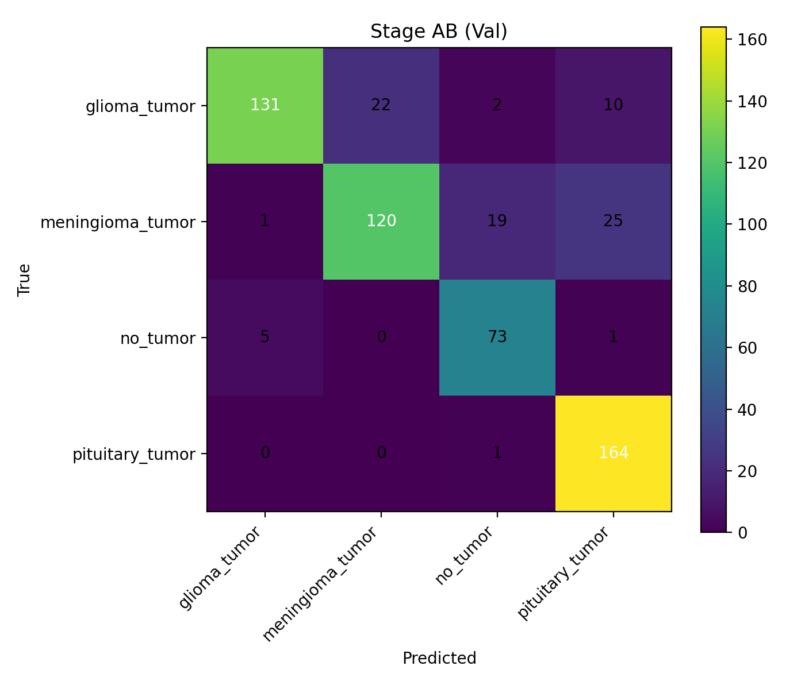

```md
# Imaging — Brain Tumor MRI (4-class)

This repo contains a reproducible baseline + a two-stage classifier (Stage A: no_tumor vs tumor, Stage B: tumor subtype).

## Dataset
Source: https://www.kaggle.com/datasets/sartajbhuvaji/brain-tumor-classification-mri

Expected structure:
```

Imaging/Data/
Training/
glioma_tumor/
meningioma_tumor/
no_tumor/
pituitary_tumor/
Testing/
glioma_tumor/
meningioma_tumor/
no_tumor/
pituitary_tumor/

````

## Setup
Create/select venv and install deps:
```bash
pip install -r requirements.txt
````

## Run (CLI)

Interactive runner:

```bash
python Imaging/scripts/main.py
```

Choose:

* `A` for Stage A only
* `AB` for full pipeline (Stage A + Stage B + 4-class eval)

Outputs are written to:

* `../Artifacts/run/` (cleared each run)

## Results snapshot

Versioned, non-overwritten outputs are stored in:

* `../results/baseline_4class/`
* `../results/new_stageAB_calibrated/`

Comparison table:

* `../results/COMPARISON.md`

## RESULTS (quick proof)

**Best run so far (TEST):** New Stage AB (calibrated)  
See: `results_snapshot/COMPARISON.md`

**Where to look (images):**
- Robust Aug v1 confusion matrices:
  - `results_snapshot/robust_aug_v1/stageAB_val_confusion_matrix.png`
  - `results_snapshot/robust_aug_v1/stageAB_test_confusion_matrix.png`

**Numbers (TEST) — from COMPARISON.md**
- Baseline 4-class: acc 0.4467, balanced 0.4314, macro F1 0.3943
- Stage AB (calibrated): acc 0.5635, balanced 0.5644, macro F1 0.5401
- Robust Aug v1: acc 0.4924, balanced 0.5076, macro F1 0.4552

**Screenshots:**


