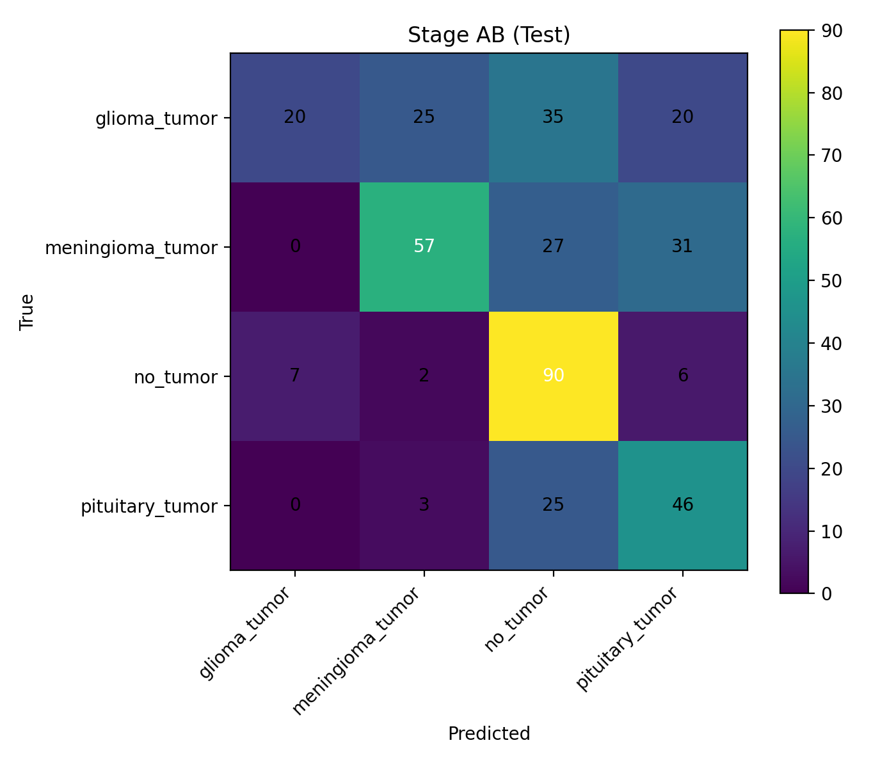
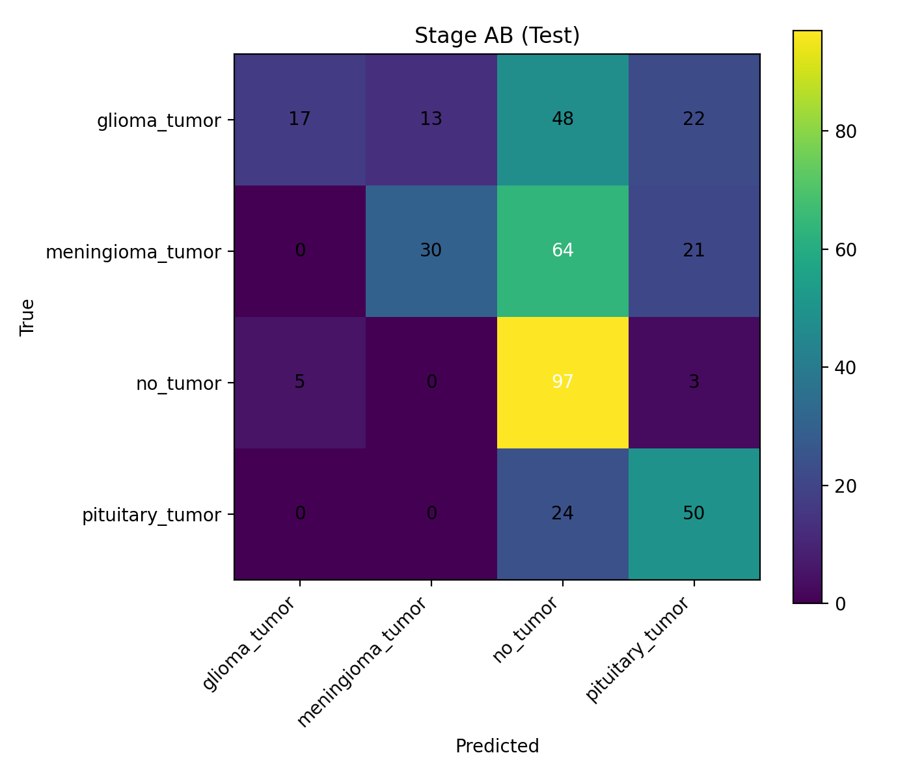

````md
# Imaging — Brain Tumor MRI (4-class)

Reproducible baseline + a two-stage classifier:
- **Stage A:** `no_tumor` vs `tumor`
- **Stage B:** tumor subtype (`glioma`, `meningioma`, `pituitary`)

## Dataset

Source: https://www.kaggle.com/datasets/sartajbhuvaji/brain-tumor-classification-mri

Expected structure (NOT pushed):

```text
Imaging/Data/
  Training/
    glioma_tumor/
    meningioma_tumor/
    no_tumor/
    pituitary_tumor/
  Testing/
    glioma_tumor/
    meningioma_tumor/
    no_tumor/
    pituitary_tumor/
````

## Setup

Create/select a venv, then install deps:

```bash
pip install torch torchvision numpy scikit-learn matplotlib tqdm pillow
```

(If you already have a working env for this repo, keep using it.)

## Run (CLI)

Interactive runner:

```bash
python .\scripts\main.py
```

Choose:

* `A` for Stage A only
* `AB` for full pipeline (Stage A + Stage B + 4-class eval)

Outputs are written to:

* `..\Artifacts\run\` (local scratch; overwritten each run)

## Results snapshots (versioned)

After each run, key outputs are copied from `..\Artifacts\run\` into:

* `results_snapshot/<run_name>/`

Comparison table (single source of truth):

* `results_snapshot/COMPARISON.md`

## RESULTS (quick proof)

Best overall run so far (TEST): **Stage B weighted CE v1**
See: `results_snapshot/COMPARISON.md`

### Proof screenshots



### Baseline (4-class ResNet18)



```
```